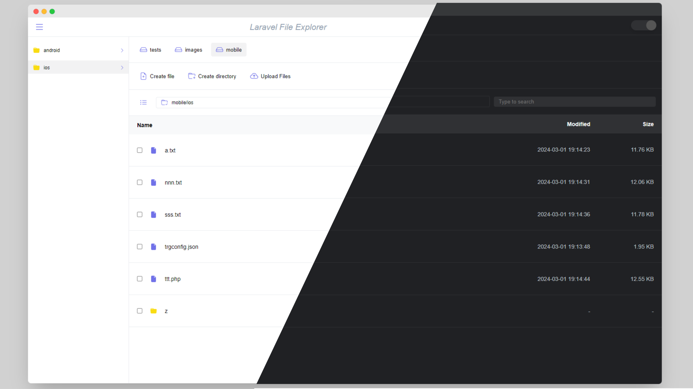
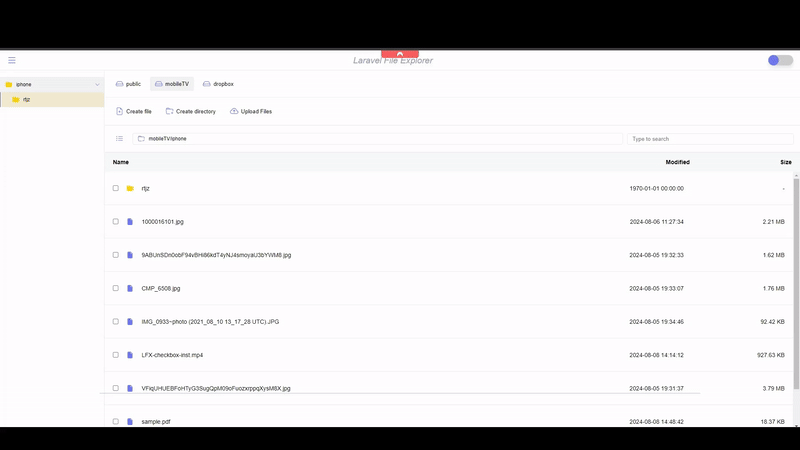
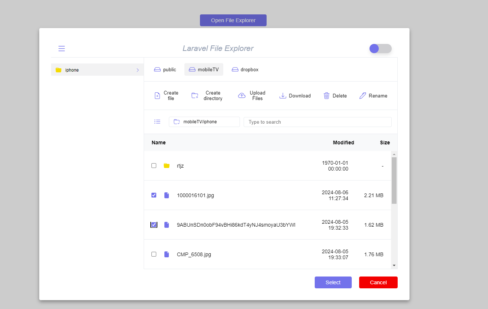

# Laravel File Explorer




Laravel File Explorer is a package for easy file management in Laravel apps, offering features like browsing, uploading, and deleting files.


## Features



- Frontend made with VueJS 3
- Light/dark mode toggle
- Utilizes Laravel Flysystem standards for file system operations
- Supports Local, FTP, S3, Dropbox, and other storage options
- Supports File System Operations:
  - CURD operations files and directories
  - Multi-upload functionality
  - Download files
  - Image preview
  - Video player
  - Audio player
  - Code editor (Codemirror)
  - Laravel events
  - ACL

## Installation

Install Laravel File Explorer backend with composer

https://github.com/Alireza-Moh/laravel-file-explorer

```bash
  composer require alireza-moh/laravel-file-explorer
```
Publish configuration file

```bash
  php artisan vendor:publish --tag=lfx.config
```
Download the frontend into your project

```bash
  npm i laravel-file-explorer
```
Add the FileExplorer component to the vue app
```js
import LaravelFileExplorer from "laravel-file-explorer";
import "laravel-file-explorer/dist/style.css";

app.use(LaravelFileExplorer);
```
Use the component inside your vue component
```javascript
  <LaravelFileExplorer :setting="{baseUrl: 'http://laravel-wrapper.localhost:8084/api/laravel-file-explorer/'}"/>
```

## Laravel File Explorer in a modal



You may use the LaravelFileExplorerInModal component to display the File Explorer as a popup, which returns an array of the selected files
```javascript
<LaravelFileExplorerInModal :setting="{baseUrl: 'http://laravel-wrapper.localhost:8084/api/laravel-file-explorer/'}"
                            v-model="selectedFiles"/>
```


The returned array is structured as follows:
```javascript
[
  {
    diskName: "mobileTV",
    parent: "iphone", //the directory where the file is located
    name: "1000016101.jpg",
    path: "iphone/1000016101.jpg",
    type: "file",
    size: 2318331,
    formattedSize: "2.21 MB",
    url: "",
    extension: "jpg",
    isChecked: true,
    lastModified: "2024-08-06 11:27:34",
    subDir: []
  },
  {
    diskName: "mobileTV",
    parent: "iphone", //the directory containing the file
    name: "9ABUnSDn0obF94vBHi86kdT4yNJ4smoyaU3bYWM8.jpg",
    path: "iphone/9ABUnSDn0obF94vBHi86kdT4yNJ4smoyaU3bYWM8.jpg",
    type: "file",
    size: 1701551,
    formattedSize: "1.62 MB",
    url: "",
    extension: "jpg",
    isChecked: true,
    lastModified: "2024-08-05 19:32:33",
    subDir: [] //if the directory contains subdirectories, they will also be included in the returned array
  }
]
```